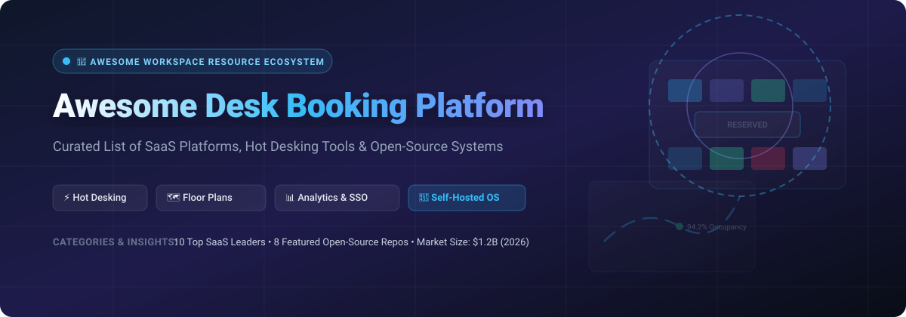

# 🏢 Awesome Desk Booking Platform & Workspace Management Ecosystem

  
  
  
  
  
  

---

## 🎯 Overview & Market Ecosystem

Welcome to the **Awesome Desk Booking Platform** repository — a curated directory of **SaaS products** and **open-source projects** dedicated to **desk booking**, **hot desking**, **workspace reservation**, **floor plan visualization**, and **hybrid work management**.

Whether you are a facilities manager optimizing corporate real estate, an HR leader coordinating hybrid team presence, or a DevOps engineer seeking self-hosted open-source desk scheduling tools, this list provides transparent comparisons of features, pricing, free tiers, and repository metrics.

---

## 📌 Table of Contents

- [🏢 SaaS & Hosted Desk Booking Platforms](#-saas--hosted-desk-booking-platforms)
- [🐳 Open-Source GitHub Projects](#-open-source-github-projects)
- [📊 Feature Matrix & Architecture Comparison](#-feature-matrix--architecture-comparison)
- [🤝 How to Contribute](#-how-to-contribute)
- [⚠️ Disclaimer](#%EF%B8%8F-disclaimer)
- [📈 Star History](#-star-history)
- [💖 Support & Community](#-support--community)

---

## 🏢 SaaS & Hosted Desk Booking Platforms

> 📈 **Market Intelligence & Sector Overview:**  
> The global workplace management and desk booking software market is valued at **$1.2 Billion in 2026** (projected to reach **$3.8 Billion by 2033** at an 18.2% CAGR). The market structure is **moderately fragmented**, anchored by large enterprise aggregators (like Eptura / Condeco) and high-growth unicorn platforms (such as Envoy) alongside specialized mid-market hybrid work providers.

The table below lists leading commercial desk booking SaaS products, **sorted by Company Size (Valuation / Revenue) descending**:

| 🏢 Platform | 💰 Company Size (Valuation / Revenue) | 🏷️ Pricing (Starting Tier) | 🎁 Free Tier / Trial Limits | ⚡ Key Features & Focus |
| :--- | :--- | :--- | :--- | :--- |
| **[Condeco (Eptura Engage)](https://www.condeco.com/)** | **$2.5B Valuation**   *(~$250M+ Revenue)* | **$3.50 / desk / month** | **14-day Free Trial**   *(Enterprise guided trial & demo)* | Enterprise desk & room scheduling, occupancy sensors, Outlook & M365 integration. |
| **[Envoy Desks](https://envoy.com/desks/)** | **$1.4B Valuation**   *(~$100M ARR)* | **$3.00 / desk / month** | **14-day Free Trial**   *(Full feature access, no credit card required)* | Hot desking, interactive floor plan maps, visitor management, health attestation. |
| **[Robin](https://robinpowered.com/)** | **$150M Valuation**   *(~$38M ARR)* | **$3.00 / user / month** | **14-day Free Trial**   *(Full workspace suite sandbox available)* | Desk & meeting room booking, floor maps, Google Workspace & Microsoft 365 syncing. |
| **[OfficeSpace](https://www.officespacesoftware.com/)** | **$100M Valuation**   *(~$25M ARR)* | **$3.50 / desk / month**   *($150/mo minimum)* | **14-day Free Trial**   *(Guided product sandbox)* | Space allocation, move management, floor plan drag-and-drop editor, footprint analytics. |
| **[Skedda](https://www.skedda.com/)** | **$75M Valuation**   *(~$15M ARR)* | **$249 / month**   *(Up to 10 spaces)* | **14-day Free Trial**   *(Full features, no credit card required)* | Flexible desk & resource scheduling, custom booking rules, interactive map view, iCal sync. |
| **[Deskbird](https://www.deskbird.com/)** | **$50M Valuation**   *(~$18M ARR)* | **€2.20 / user / month**   *(~$2.40)* | **14-day Free Trial**   *(Free Starter plan available for small teams)* | European market leader, desk & room booking, team presence coordination, MS Teams integration. |
| **[Eden Workplace](https://edendenworkplace.com/)** | **$40M Valuation**   *(~$10M ARR)* | **$2.00 / user / month** | **Free Starter Plan**   *(Up to 10 users free forever)* | Desk booking, visitor management, internal ticketing, office check-in policies. |
| **[Kadence](https://kadence.co/)** | **$30M Valuation**   *(~$8M ARR)* | **$2.50 / user / month** | **14-day Free Trial**   *(Guided platform onboarding)* | Hybrid workplace scheduling, desk/room/parking reservation, active-user billing. |
| **[Officely](https://officely.app/)** | **$15M Valuation**   *(~$4M ARR)* | **$2.50 / user / month** | **Free Plan for up to 10 users**   *(Free forever for micro teams)* | Native Slack & MS Teams desk booking app, team presence tracking, office lunch planning. |
| **[Tactic](https://tactic.io/)** | **$10M Valuation**   *(~$2M ARR)* | **$2.50 / user / month** | **14-day Free Trial**   *(Full access to desk & room booking)* | Desk booking, hybrid schedule coordination, office check-ins, visitor logs. |

---

## 🐳 Open-Source GitHub Projects

Desk booking has an active open-source ecosystem catering to organizations requiring total data privacy, on-premise execution, or custom UI integrations. 

The list below is **sorted by GitHub Stars_Count descending**, with each repository Stars_Badge linking directly to its stargazers page:

### 1. **[Seatsurfing](https://github.com/seatsurfing/backend)** 
- **Tech Stack:** Go (Backend REST API), TypeScript / React (Web PWA), PostgreSQL, Docker, Kubernetes.
- **Description:** The leading open-source desk and room booking system. Features interactive floor plan visualization with drag-and-drop tools, multi-language support, Microsoft Teams & Confluence integration, and multi-architecture Docker container deployment (amd64, arm64).

### 2. **[Classroom Bookings](https://github.com/classroombookings/classroombookings)** 
- **Tech Stack:** PHP / CodeIgniter, MySQL.
- **Description:** Web-based room, desk, and computer lab reservation system designed for educational institutions and corporate training environments with recurring booking support.

### 3. **[MRBS (Meeting Room Booking System)](https://github.com/meeting-room-booking-system/mrbs-code)** 
- **Tech Stack:** PHP, MySQL / PostgreSQL.
- **Description:** Time-tested, multi-language web application for booking desks, meeting rooms, and shared office assets with LDAP/Active Directory authentication.

### 4. **[WARP (Workspace Autonomous Reservation Program)](https://github.com/sebo-b/warp)** 
- **Tech Stack:** Python (Flask), PostgreSQL, Docker / uWSGI.
- **Description:** Comprehensive hybrid office management solution supporting assigned seating, hot desking, parking stall allocation, floor zone constraints, iCal feeds, and SAML/LDAP/Azure AD/OIDC single sign-on.

### 5. **[OpenDesk](https://github.com/kanwalnainsingh/OpenDesk)** 
- **Tech Stack:** JavaScript, Node.js, Express, MongoDB.
- **Description:** Lightweight open-source desk reservation platform focused on desk capacity planning, booking cancellations, and daily employee office schedule tracking.

### 6. **[LibreBooking](https://github.com/LibreBooking/librebooking)** 
- **Tech Stack:** PHP, MySQL.
- **Description:** Mature community-maintained fork of Booked Scheduler. Supports resource reservation (desks, rooms, equipment), approval workflows, recurring slots, quota management, and REST API access.

### 7. **[Workplacify](https://github.com/igeligel/workplacify)** 
- **Tech Stack:** Next.js, React, TypeScript, PostgreSQL, Tailwind CSS.
- **Description:** Modern desk reservation and scheduling platform built specifically for hybrid workplaces with interactive canvas floor map support.

### 8. **[Roomer](https://github.com/c0dewhacker/Roomer)** 
- **Tech Stack:** TypeScript, React, Fastify, SQLite / PostgreSQL.
- **Description:** Self-hosted platform for office desk and asset reservation allowing admins to upload custom floor plan images and pin bookable resources directly on canvas maps.

---

## 📊 Feature Matrix & Architecture Comparison

| Feature / Capability | Commercial SaaS Tiers | Open-Source Systems |
| :--- | :--- | :--- |
| **Primary Deployment** | Cloud Hosted / Managed | Docker, Kubernetes, Bare-Metal |
| **Floor Plan Visualization** | Interactive drag-and-drop, 3D views | Seatsurfing, Workplacify, Roomer |
| **SSO / IAM Integration** | Azure AD, Okta, Google Workspace | SAML 2.0, OIDC, LDAP (WARP, MRBS) |
| **Chat Ops Integration** | Slack App, MS Teams Bot | Seatsurfing (Teams), Officely (Slack) |
| **Occupancy Analytics** | IoT Hardware Sensors, Heatmaps | Database Reports & iCal Exports |
| **Data Ownership** | Vendor Cloud Storage | 100% Self-Hosted & Local Control |

---

## 🤝 How to Contribute

Contributions are warmly welcome! Help us maintain the most up-to-date desk booking directory.

1. **Fork the repository** on GitHub.
2. Edit `README.md` to add your SaaS platform or open-source repo.
3. Ensure all descriptions remain **objective and factual**.
4. Verify that Stars_Badges point to `https://github.com/{owner}/{repo}/stargazers`.
5. Submit a **Pull Request** with a clear title describing your addition.

Refer to [Awesome-Awesome-Awesome](https://github.com/ishandutta2007/Awesome-Awesome-Awesome) for awesome list standards.

---

## ⚠️ Disclaimer

- This directory is **community-curated** for informational purposes and does not constitute a endorsement.
- Workplace scheduling platforms handle employee location and attendance logs. Always ensure compliance with regional privacy laws (GDPR, CCPA) when storing occupancy analytics.

---

## 📈 Star History

---

## 💖 Support & Community

If you find this repository helpful for evaluating workplace management tools or deploying open-source desk booking systems:

- ⭐ **Star this repository** on GitHub to show your appreciation and help others discover it!
- 🔀 **Fork & Share** it with facilities managers, workplace experience engineers, and hybrid work leaders.
- 💬 Join our community on **[Discord](https://discord.gg/jc4xtF58Ve)** to discuss workplace technology and open-source solutions.
- ☕ **Sponsor / Buy Me a Coffee**: Support ongoing open-source repository maintenance via [GitHub Sponsors](https://github.com/sponsors/ishandutta2007)!

  <b>Made with ❤️ for facilities managers, workplace experience teams, HR leaders, and software engineers.</b>

